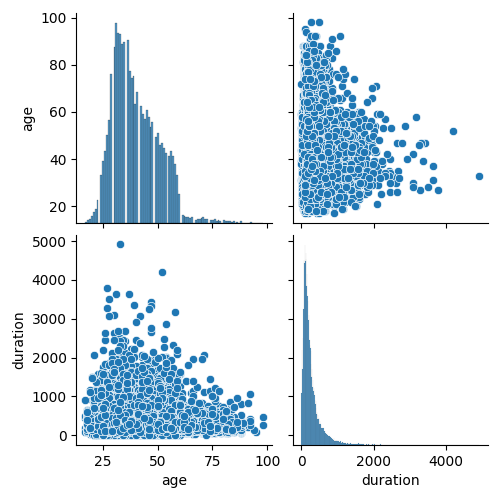
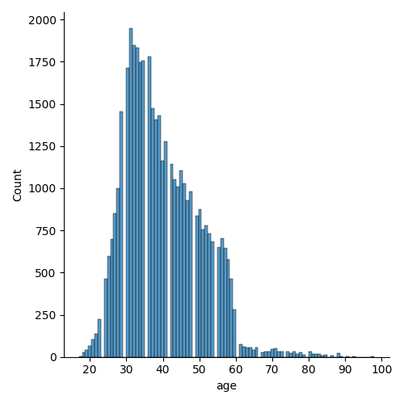
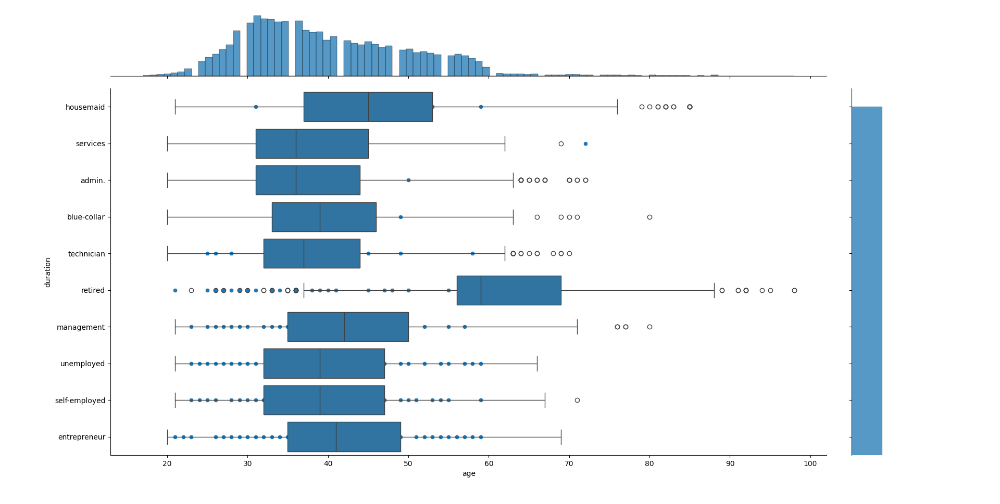
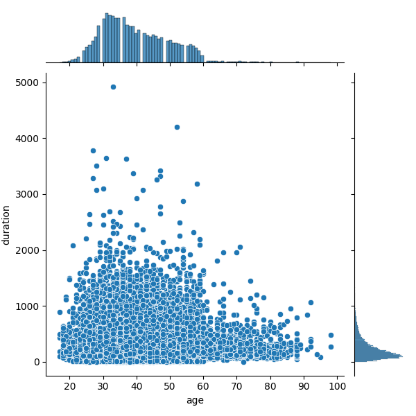
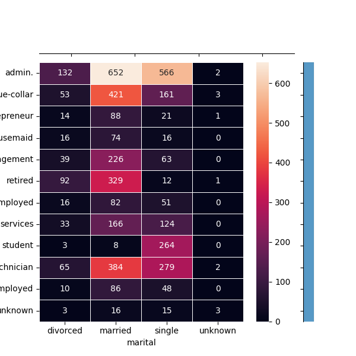
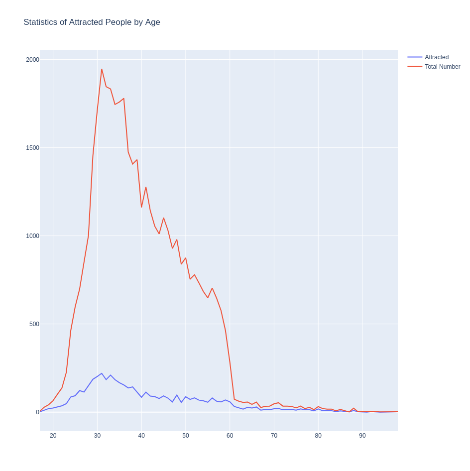
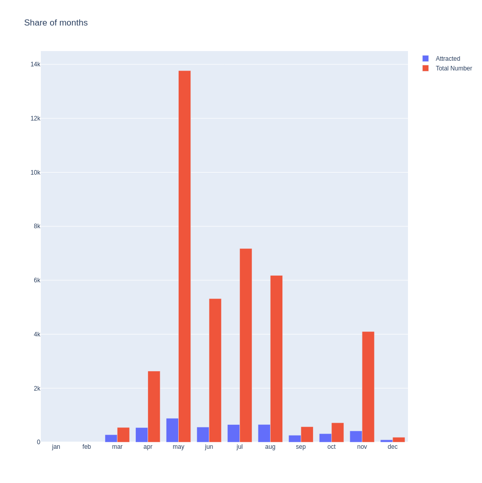

# Pylib

Ce projet a pour but d'analyser et de visualiser des **données bancaires**.
Pour cela on va utiliser différentes librairies python ainsi que des données open source : **Bank Marketing Data Set**, qui est un large ensemble de données (dataset) de marketing bancaire.

- Seaborn est une lib python de visualisation de données basée sur matplotlib.
- Plotly est une lib python de visualisation de données interactive.
- Pandas est une lib python de manipulation de données.

# Seaborn
- pairplot permet de visualiser les relations entre les variables de notre dataframe.

- displot permet de visualiser la distribution d'une variable.

- boxplot permet de visualiser la distribution d'une variable en fonction d'une autre variable.

- jointplot permet de visualiser la distribution de deux variables.

- heatmap permet de visualiser la corrélation entre les variables. C'est mon préféré.

# Plotly
En plotly, on peut créer des figures avec des listes de lignes appelées traces.
Plotly créer des graphiques html qu'on peut télécharger sous format png.

# Pandas
- crosstab est une méthode de Pandas qui permet de calculer une table de contingence entre deux (ou plus) variables catégorielles.